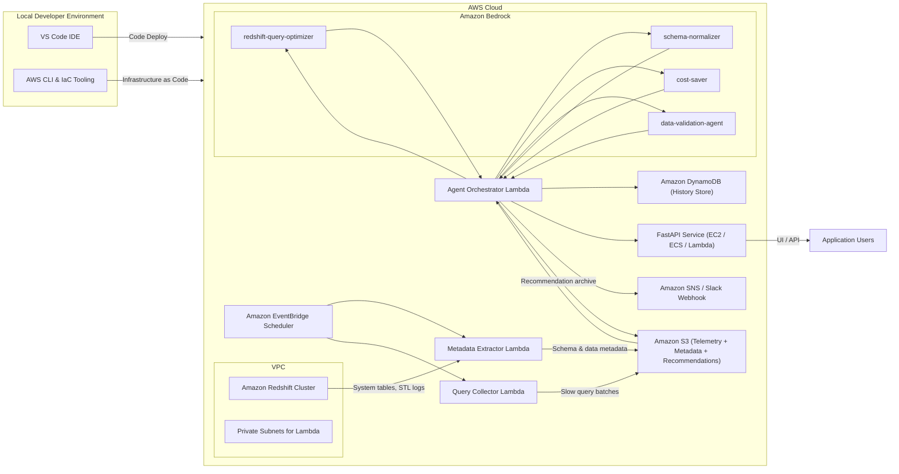

# AWS Redshift & Bedrock Migration Playbook

## 1. Introduction
This playbook provides a comprehensive, step-by-step guide for migrating the existing **MariaDB Query Optimizer FastAPI application** to a fully managed **AWS-native ecosystem** built on **Amazon Redshift** telemetry and **Claude models on Amazon Bedrock**. It explains exactly how to reproduce every capability of the current project—query submission, multi-agent optimization workflows, schema review, cost governance, data validation, history tracking, and alerting—using AWS services. The design orchestrates four specialized Bedrock agents, persists Redshift schema and data metadata in Amazon S3, and keeps that metadata automatically refreshed as underlying structures evolve day to day. Follow the sequence in this document to reproduce the solution from scratch without prior AWS experience.

## 2. Prerequisites
1. **AWS Account & Permissions**
   - Root or administrator-level access (temporary) to enable Amazon Bedrock (per region) and provision IAM roles and policies.
   - MFA enforced on the AWS account.
2. **Local Workstation Setup**
   - Python 3.11+.
   - AWS CLI v2 configured (`aws configure`).
   - Git and Git LFS (if architecture diagrams or prompts are large binaries).
   - Terraform, AWS SAM, or CloudFormation tooling (choose one for infrastructure-as-code).
3. **Existing Codebase Access**
   - Current FastAPI project (`B_Project`) with knowledge of endpoints, models, storage, and UI.
   - Documentation describing the MariaDB-based optimizer flow.
4. **Planning Artifacts**
   - Client requirement PDF.
   - This playbook printed or bookmarked.
   - User credential vault (password manager) to store generated secrets.

## 3. Source Project Parity Checklist
| On-Prem / Existing Feature | AWS Equivalent | Implementation Notes |
| --- | --- | --- |
| Web UI query submission & optimization request | FastAPI service hosted on EC2/ECS/Lambda + API Gateway | Reuse FastAPI routes; add new `/optimize/redshift` and `/ingest/bedrock` endpoints. |
| MariaDB query optimizer logic | Bedrock agent `redshift-query-optimizer` | Invoke via orchestrator Lambda; persist output to DynamoDB and S3. |
| Schema analysis routines | Bedrock agent `schema-normalizer` + S3 metadata store | Provide up-to-date schema metadata pulled from Redshift daily. |
| Cost monitoring scripts | Bedrock agent `cost-saver` with Redshift system tables | Feed agent historical query metrics and table size stats extracted into S3. |
| Data validation jobs | Bedrock agent `data-validation-agent` | Compare Redshift tables with source metadata stored in S3 (manifests from ETL). |
| Historical recommendation storage | DynamoDB (`query-optimization-history`) and S3 (`recommendations/`) | DynamoDB for fast lookup, S3 for long-term archive & Bedrock context. |
| Email / Slack alerts | Amazon SNS + Slack webhook | Lambda orchestrator publishes notifications. |
| Manual schema documentation | Automated metadata JSON files in S3 (`metadata/schema.json`, `metadata/data_profile.json`) | Regenerated daily via metadata refresh Lambda. |

## 4. High-Level Timeline
| Day | Track | Key Outcomes |
| --- | --- | --- |
| Day 0 | Preparation | AWS account ready, Bedrock access requested, local tooling installed, feature-parity checklist reviewed |
| Day 1 (Morning) | Core AWS Foundation | VPC, Redshift, S3 buckets, IAM roles, Secrets Manager entries provisioned |
| Day 1 (Midday) | Metadata Lake | S3 metadata bucket structured, Glue crawler/Lambda metadata extractor deployed, metadata JSON exported |
| Day 1 (Afternoon) | Telemetry & Agents | Lambdas (query collector, metadata extractor, orchestrator) deployed; Bedrock agents configured |
| Day 1 (Late) | FastAPI Integration | New endpoints, environment variables, and agent results UI implemented; notifications wired |
| Day 1 (Evening) | Testing & Automation | End-to-end workflow validated; EventBridge schedules confirmed; documentation updated |

## 5. Environment Diagram


## 6. Detailed Implementation Plan
### 6.1 Day 0 – Preparation
1. **Confirm AWS Access**
   - Log in with MFA.
   - Enable Bedrock in `us-east-1` (or chosen region) under *Amazon Bedrock → Model access*.
2. **Review Existing FastAPI Application**
   - Identify routes handling query submissions, history, and notifications.
   - Catalogue existing schemas, sample queries, and stored metadata files to reproduce in S3.
   - Document configuration values (database URLs, secrets) that must migrate to AWS Secrets Manager.
3. **Create Project Branch & Repo Structure**
   - `git checkout -b feature/aws-redshift-bedrock`.
   - In repo, add directories: `infra/` (templates), `lambdas/`, `fastapi/` (new or updated code), `docs/`.
4. **Plan Infrastructure as Code**
   - Choose Terraform or SAM. Outline modules/stacks for VPC, Redshift, Lambdas, DynamoDB, S3, EventBridge.
5. **Bedrock Model Access Request**
   - Request `anthropic.claude-3-sonnet-20240229-v1:0` (minimum) and optionally `anthropic.claude-3-opus-20240229-v1:0`.
6. **Define Secrets Inventory**
   - Redshift admin credentials, FastAPI webhook token, Slack webhook URL, optional API keys.
7. **Draft Metadata Schema**
   - Decide JSON structures for `schema.json`, `data_profile.json`, `query_samples.json` to store in S3.
8. **Align Team**
   - Share this playbook with stakeholders; schedule Day 1 checkpoints.

### 6.2 Day 1 Morning – Core AWS Foundation
1. **Provision VPC & Networking**
   - CIDR: `10.0.0.0/16`.
   - Private subnets (AZ-a, AZ-b) for Redshift and Lambdas.
   - Public subnet (optional) for bastion/NAT.
   - NAT Gateway + route tables enabling outbound access for private subnets.
   - Security Groups:
     - `sg-redshift` allowing inbound 5439 from Lambda subnets.
     - `sg-lambda` allowing outbound 443 (Bedrock, S3, DynamoDB) and 5439 (Redshift Data API endpoint).
2. **Provision Amazon Redshift**
   - Node type RA3 or DC2 per cost/performance.
   - Database `analytics`, admin user stored in Secrets Manager (`/prod/redshift/admin`).
   - Enable logging to S3 (use dedicated bucket folder `logs/redshift/`).
   - Configure Workload Management queues for interactive vs. background workloads.
3. **Create S3 Buckets**
   - `redshift-telemetry-bucket` (versioning enabled) with folders:
     - `metadata/schema/`
     - `metadata/data_profile/`
     - `metadata/query_history/`
     - `recommendations/`
     - `bedrock-context/`
   - Enable default SSE-S3 encryption and access logging.
4. **Create DynamoDB Table**
   - Table: `query-optimization-history`.
   - Partition key `query_hash` (string), sort key `analysis_timestamp` (ISO8601 string).
   - Enable point-in-time recovery.
5. **IAM Roles & Policies**
   - **`LambdaExecutionRole`** with policies for:
     - `bedrock:InvokeModel`, `bedrock:InvokeModelWithResponseStream`.
     - `redshift-data:*` (scoped to cluster resource).
     - `dynamodb:PutItem`, `dynamodb:Query`, `dynamodb:UpdateItem` on history table.
     - `s3:GetObject`, `s3:PutObject`, `s3:ListBucket` on telemetry bucket.
     - `secretsmanager:GetSecretValue` for relevant secrets.
     - `logs:CreateLogGroup`, `logs:CreateLogStream`, `logs:PutLogEvents`.
   - **`RedshiftLoggingRole`** for S3 export.
   - **`FastAPIServerRole`** (if running on ECS/EC2/Lambda) with permission to read S3 metadata and DynamoDB entries.
6. **Secrets Manager Entries**
   - `/prod/redshift/admin` with username/password.
   - `/prod/fastapi/webhook-token` for orchestrator authentication.
   - `/prod/notifications/slack` for SNS HTTP subscription if needed.
7. **EventBridge Baseline Rules (Skeleton)**
   - Hourly `QueryCollectorSchedule` (disabled until Lambda deployed).
   - Daily `MetadataRefreshSchedule` at 02:00 UTC.

### 6.3 Day 1 Midday – Metadata Lake on S3
1. **Plan Metadata Formats**
   - `metadata/schema/schema.json` structure:
     ```json
     {
       "extract_timestamp": "2024-05-21T02:00:00Z",
       "tables": [
         {
           "table_name": "public.sales",
           "row_count": 12543098,
           "dist_style": "KEY",
           "dist_key": "customer_id",
           "sort_keys": ["sale_date"],
           "columns": [
             {"name": "sale_id", "type": "BIGINT", "encoding": "RAW", "nullable": false},
             {"name": "customer_id", "type": "INTEGER", "encoding": "ZSTD", "nullable": false}
           ]
         }
       ]
     }
     ```
   - `metadata/data_profile/profile.json` summarizing min/max, null ratio, top values for critical columns.
   - `metadata/query_history/yyyymmdd/query_samples.json` containing representative queries for agents.
2. **Deploy Metadata Extractor Lambda**
   - Runtime: Python 3.11.
   - Dependencies: `boto3`, `psycopg2-binary` (if using direct connection), `tenacity` for retries.
   - Logic steps:
     1. Connect to Redshift via Data API or JDBC.
     2. Query `SVV_TABLE_INFO`, `SVV_COLUMN_INFO`, `SVL_QLOG`, `STL_QUERY` to capture schema and usage statistics.
     3. Build JSON payloads and write to S3 (`metadata/schema/schema.json`, `metadata/data_profile/profile-YYYYMMDD.json`).
     4. Generate CSV of recent query statistics into `metadata/query_history/`.
     5. Publish summary to CloudWatch logs.
   - Environment variables: `S3_METADATA_BUCKET`, `REDSHIFT_SECRET_ARN`, `AWS_REGION`.
3. **Optional AWS Glue Crawler**
   - Configure crawler to catalog `metadata/` folder for Athena querying.
   - Schedule crawler post-Lambda run to maintain Data Catalog.
4. **Automate Metadata Refresh**
   - Attach `MetadataRefreshSchedule` EventBridge rule to trigger the Lambda daily.
   - Add `maxEventAgeInSeconds` = 3600 and `retryAttempts` = 2 for robustness.
5. **Manual Validation**
   - Run Lambda test invocation from console.
   - Verify JSON/CSV objects appear with correct structure and timestamps.
   - Store sample outputs locally for reference.

### 6.4 Day 1 Afternoon – Telemetry & Agent Orchestration
1. **Query Collector Lambda**
   - Runtime: Python 3.11.
   - Responsibilities: pull slow queries from Redshift, write raw telemetry to S3, optionally send payload to orchestrator via EventBridge pipe.
   - Pseudocode:
     ```python
     def handler(event, context):
         queries = fetch_slow_queries(limit=50)  # SELECT from STL_QUERY
         write_to_s3("metadata/query_history/" + today + "/slow_queries.json", queries)
         invoke_orchestrator(queries)
     ```
   - Use Secrets Manager to retrieve Redshift credentials automatically.
   - Deploy via SAM/Terraform with environment variables (`S3_METADATA_BUCKET`, `ORCHESTRATOR_ARN`).
2. **Agent Orchestrator Lambda**
   - Purpose: For each incoming query context, orchestrate four Bedrock agents and aggregate responses.
   - Steps per execution:
     1. Load latest schema metadata from S3 (`schema.json`, `profile-<date>.json`).
     2. Build agent-specific prompts with context: query text, schema details, usage statistics.
     3. Invoke Bedrock sequentially (or with concurrency) for agents:
        - `redshift-query-optimizer`
        - `schema-normalizer`
        - `cost-saver`
        - `data-validation-agent`
     4. Parse JSON responses, attach metadata such as `agent_name`, `confidence`, `action_items`.
     5. Persist combined payload to DynamoDB and append JSON to S3 `recommendations/YYYY/MM/DD/<query_hash>.json`.
     6. POST summarized result to FastAPI webhook with bearer token from Secrets Manager.
     7. Publish notification to SNS when critical issues detected.
   - Include exponential backoff (e.g., `tenacity`) for Bedrock throttling.
   - Example Bedrock invocation snippet:
     ```python
     response = bedrock.invoke_model(
         modelId=os.environ["BEDROCK_MODEL_ID"],
         contentType="application/json",
         accept="application/json",
         body=json.dumps({
             "anthropic_version": "bedrock-2023-05-31",  # per SDK docs
             "max_tokens": 2000,
             "temperature": 0.4,
             "messages": [
                 {"role": "system", "content": agent_system_prompt},
                 {"role": "user", "content": user_prompt}
             ]
         })
     )
     ```
3. **Agent Context Builder**
   - Store system prompts in S3 `bedrock-context/prompts/<agent>.txt`.
   - Lambda loads prompts at runtime to avoid redeployment for updates.
   - Include `schema.json` and `profile.json` excerpts in prompts but chunk to avoid token limits.
4. **SNS / Slack Notifications**
   - Create SNS topic `redshift-optimization-alerts`.
   - Subscribe email and HTTPS Slack webhook.
   - Lambda publishes when recommendations include severity `HIGH` or `validation_failures > 0`.
5. **Permissions Check**
   - Ensure orchestrator role can read S3 metadata, write to `recommendations/`, access DynamoDB, invoke Bedrock, post to FastAPI (via VPC endpoint or internet).
6. **Deployment**
   - Package Lambdas with dependencies using AWS SAM build, Lambda layers, or container images.
   - Deploy infrastructure stack.
   - Record ARNs and environment variable values.

### 6.5 Day 1 Late – FastAPI Cloud Integration
1. **Environment Variables** (`.env` or AWS Parameter Store)
   - `AWS_REGION`
   - `BEDROCK_MODEL_ID=anthropic.claude-3-sonnet-20240229-v1:0`
   - `DYNAMODB_TABLE=query-optimization-history`
   - `S3_METADATA_BUCKET=redshift-telemetry-bucket`
   - `REDISHT_WEBHOOK_TOKEN` (stored securely; note typo—should be `REDSHIFT_WEBHOOK_TOKEN` when implemented)
2. **New Endpoints**
   - `POST /ingest/bedrock`
     - Validate bearer token header (`Authorization: Bearer <token>`).
     - Schema: `{ "query_hash": str, "query_text": str, "agents": [ ... ], "recommendations": {...} }`.
     - Persist payload to DynamoDB or local store for UI.
   - `POST /optimize/redshift`
     - Accepts raw SQL string from user.
     - Calls orchestrator API (via API Gateway) or publishes message to SQS to trigger orchestrator.
     - Returns job status ID for polling.
3. **Metadata Viewer**
   - `GET /metadata/schema` returning latest `schema.json` from S3 (cached locally).
   - `GET /metadata/data-profile` returning daily stats.
4. **Frontend / UI Updates**
   - Display sections for each agent:
     - Optimization recommendations.
     - Schema change alerts.
     - Cost savings.
     - Data validation results.
   - Provide download link to original metadata JSON for transparency.
5. **History & Analytics**
   - Enhance `/history` route to query DynamoDB for past `query_hash` entries.
   - Add filters (date range, agent severity, cost impact).
6. **Testing Locally**
   - Use `moto` or local mocks to simulate S3/DynamoDB for unit tests.
   - Create integration tests hitting real AWS endpoints (in dev account) guarded by feature flag.
7. **Deployment Strategy**
   - Containerize FastAPI (Docker) and deploy to ECS Fargate or App Runner.
   - Alternatively, package as Lambda via AWS Lambda Powertools + API Gateway for serverless approach.

## 7. Agent Configuration Playbook
### 7.1 `redshift-query-optimizer`
- **Purpose**: Rewrite and optimize slow/inefficient SQL queries.
- **Prompt Handling**:
  1. Load query text, table schemas, distribution/sort keys from `schema.json`.
  2. Provide execution stats (execution time, scans) from `slow_queries.json`.
  3. Ask for recommendations on JOIN order, predicate pushdown, materialized views, sort/dist keys.
- **Output Format** (JSON):
  ```json
  {
    "optimized_query": "SELECT ...",
    "analysis": ["Replace CROSS JOIN with INNER JOIN..."],
    "estimated_benefit": "~40% scan reduction",
    "additional_actions": ["Consider DISTKEY on customer_id"]
  }
  ```
- **Tools**: `read`, `edit`, `explain-plan`, `schema-introspect` (conceptual placeholders provided to Claude prompt for reasoning).

### 7.2 `schema-normalizer`
- **Purpose**: Review Redshift table designs for normalization/denormalization, distribution, encoding.
- **Prompt Inputs**: `schema.json`, `profile.json`, join frequency from `query_history`.
- **Guidelines**:
  - Flag over-normalized tables causing large joins.
  - Recommend distribution style/key and sort key adjustments.
  - Suggest column encoding (e.g., `ENCODE ZSTD`).
- **Output**: actionable steps with priority tags.

### 7.3 `cost-saver`
- **Purpose**: Reduce Redshift compute/storage costs.
- **Prompt Inputs**: Query frequencies, table sizes, WLM queue stats.
- **Recommendations**:
  - Use materialized views, result set caching.
  - Drop unused tables/columns.
  - Adjust `automatic_workload_management` or concurrency scaling.
  - Offload cold data to S3 (UNLOAD + Spectrum).

### 7.4 `data-validation-agent`
- **Purpose**: Ensure data integrity between Redshift and sources (S3 manifests, RDS snapshots).
- **Prompt Inputs**:
  - S3 metadata (row counts from ETL, checksum files).
  - Redshift table summaries (row counts, min/max).
- **Tasks**:
  - Compare counts, highlight drift.
  - Flag null anomalies or duplicate primary keys.
  - Suggest remediation steps (re-run ETL, fix mapping).

### 7.5 Prompt Management & Versioning
- Store prompts in S3 with semantic versioning (`bedrock-context/prompts/v1/<agent>.txt`).
- Add metadata file `bedrock-context/prompts/manifest.json` capturing versions and change logs.
- Expose CLI script to update prompts and invalidate Lambda cache (e.g., via Parameter Store).

### 7.6 Step-by-Step Agent Creation Instructions
1. **Create Prompt Files**
   - For each agent, craft the system prompt using the guidance below and save it locally as `<agent>.prompt.md`.
   - Include JSON response schemas to enforce structured outputs.
2. **Upload Prompts to S3**
   - Run `aws s3 cp ./prompts/<agent>.prompt.md s3://redshift-telemetry-bucket/bedrock-context/prompts/v1/<agent>.txt`.
   - Update `manifest.json` with version, author, and date.
3. **Register Prompts in Parameter Store**
   - Create String parameters (e.g., `/prod/bedrock/prompts/redshift-query-optimizer`) containing the S3 URI.
   - Grant the orchestrator Lambda `ssm:GetParameter` permission.
4. **Update Lambda Configuration**
   - Add environment variables `PROMPT_MANIFEST_PARAMETER` and `PROMPT_VERSION`.
   - Ensure Lambda fetches prompt URIs on cold start and caches contents in memory.
5. **Test Bedrock Invocation**
   - Use `boto3` script locally or Lambda test event to submit a dummy query and verify JSON output matches schema.

#### 7.6.1 `redshift-query-optimizer`
1. Write the system prompt verbatim from the requirement (include role as Redshift SQL performance expert).
2. Append explicit instructions for output structure:
   ```json
   {
     "optimized_query": "<string>",
     "analysis": ["<string>", "<string>"] ,
     "estimated_benefit": "<string>",
     "additional_actions": ["<string>"]
   }
   ```
3. Save as `prompts/redshift-query-optimizer.prompt.md` and upload to S3.
4. In orchestrator Lambda, map agent key `"redshift-query-optimizer"` to the prompt URI and to the Bedrock model `anthropic.claude-3-sonnet-20240229-v1:0`.
5. Run a sample optimization against a known slow query and verify the response is valid JSON.

#### 7.6.2 `schema-normalizer`
1. Compose instructions emphasizing denormalization guidance, distribution/sort key advice, and encoding suggestions.
2. Define output schema:
   ```json
   {
     "schema_findings": ["<string>"],
     "distribution_recommendations": ["<string>"],
     "sort_key_recommendations": ["<string>"],
     "encoding_recommendations": ["<string>"]
   }
   ```
3. Save as `prompts/schema-normalizer.prompt.md`, upload to S3, update manifest.
4. Ensure orchestrator loads latest schema metadata chunks and includes them in the user message.
5. Trigger Lambda test referencing an updated table to make sure suggestions mention distribution/sort keys.

#### 7.6.3 `cost-saver`
1. Draft prompt covering cost analysis, WLM advice, materialized views, and cold data archiving.
2. Use response template:
   ```json
   {
     "high_cost_queries": ["<string>"],
     "cost_reduction_actions": ["<string>"],
     "wlm_recommendations": ["<string>"],
     "storage_optimizations": ["<string>"]
   }
   ```
3. Store as `prompts/cost-saver.prompt.md`, upload, and record version.
4. Supply query history stats (from `metadata/query_history/`) and table size metrics when invoking the agent.
5. Validate output identifies at least one materialized view or caching opportunity using sample telemetry.

#### 7.6.4 `data-validation-agent`
1. Build prompt stressing row-count comparisons, aggregate checks, and anomaly detection between Redshift and source data.
2. Output schema:
   ```json
   {
     "validation_checks": ["<string>"],
     "issues_detected": ["<string>"],
     "recommended_fixes": ["<string>"],
     "confidence_score": "<string>"
   }
   ```
3. Save as `prompts/data-validation-agent.prompt.md`, upload, update manifest.
4. Provide context objects: S3 ETL manifests, Redshift aggregates, source row counts.
5. Test with intentional discrepancies to ensure the agent flags mismatches and suggests remediation.

## 8. Metadata Refresh Automation
1. **Daily EventBridge Rule**
   - Cron expression: `0 2 * * ? *` (02:00 UTC).
   - Targets: Metadata Extractor Lambda, followed by optional Glue crawler.
2. **Lambda Processing Steps**
   1. Pull table list with `SELECT * FROM SVV_TABLE_INFO`.
   2. Fetch column stats `SELECT * FROM SVV_COLUMN_INFO`.
   3. Compute data profile metrics (min/max/avg/null_count) using Redshift SQL.
   4. Save current metadata under `metadata/schema/schema.json` (overwrite) and timestamped copy `metadata/schema/schema-YYYYMMDD.json`.
   5. Save data profile to `metadata/data_profile/profile-YYYYMMDD.json`.
   6. Extract previous day query logs (`STL_QUERY`, `SVL_QLOG`) filtered by runtime > threshold; write to `metadata/query_history/YYYY/MM/DD/slow_queries.json`.
   7. Publish SNS notification summarizing changes (# of tables altered, columns added/removed).
3. **Change Detection**
   - Lambda compares new schema snapshot to previous version.
   - If change detected, write diff to `metadata/schema/diff-YYYYMMDD.json` (list additions/removals) to help agents.
4. **Glue/Athena Integration**
   - Glue crawler updates data catalog for `metadata/` prefix.
   - Analysts can query metadata via Athena for manual validation.
5. **Logging & Alerts**
   - Push metrics `MetadataTablesProcessed`, `SchemaChangesDetected` to CloudWatch.
   - Create alarm if extractor fails or if `SchemaChangesDetected > 0` to notify DBA for review.

## 9. Security Considerations
- **Least Privilege IAM**: restrict Lambda roles to specific bucket prefixes and DynamoDB tables.
- **Secret Rotation**: enable Secrets Manager rotation for Redshift credentials (30-day cycle).
- **Encryption**: use SSE-S3, DynamoDB KMS encryption, and optionally customer-managed CMKs.
- **Network Isolation**: leverage VPC endpoints for Bedrock runtime, S3, DynamoDB, and Secrets Manager.
- **Data Sanitization**: mask or redact PII before sending queries to Bedrock; use placeholder values in prompts.
- **API Security**: enforce HTTPS, signed payloads, and JWT/bearer token checks between Lambda and FastAPI.

## 10. Operations & Monitoring
1. **CloudWatch Dashboards**
   - Metrics: Lambda duration/error, Bedrock latency, DynamoDB throttles, schema change counts.
2. **Alarms**
   - `LambdaFailureAlarm` for orchestrator.
   - `BedrockThrottleAlarm` when invocation errors exceed threshold.
   - `MetadataRefreshMissed` when no run in 24h.
3. **Logging**
   - Structure logs with correlation IDs (`query_hash`).
   - Ship logs to S3 via Firehose if long-term retention required.
4. **Runbooks**
   - Document procedures for rerunning metadata extraction, reprocessing failed queries, rotating prompts.

## 11. Cost Estimate (Ballpark)
| Component | Estimated Cost |
| --- | --- |
| Redshift (single RA3) | ~$1.20/hour |
| Lambda (metadata + orchestrator + collector) | <$10/month |
| Bedrock Claude 3 Sonnet | ~$0.003 / 1K tokens (estimate $40–$80/month depending on volume) |
| DynamoDB (on-demand) | <$10/month |
| S3 storage & requests | <$5/month |
| EventBridge, SNS | Negligible |
| Glue crawler (optional) | <$5/run when daily |

## 12. Testing & Validation Checklist
1. **Infrastructure Validation**
   - `SELECT 1` via Redshift query editor from Lambda.
   - Confirm S3 buckets exist with correct prefixes and encryption.
   - Validate IAM role permissions using AWS IAM Access Analyzer.
2. **Metadata Extractor Tests**
   - Invoke Lambda manually; inspect generated JSONs for accuracy.
   - Compare schema JSON vs. actual Redshift schema (spot check table).
3. **Agent Orchestrator Dry Run**
   - Upload sample `slow_queries.json` to S3; trigger orchestrator with test event.
   - Verify DynamoDB entry created and S3 recommendation file stored.
4. **FastAPI Integration**
   - Use `curl`/Postman to simulate orchestrator POST to `/ingest/bedrock`.
   - Submit sample query via `/optimize/redshift`; ensure orchestrator invoked.
5. **End-to-End Scenario**
   - Execute intentionally slow query in Redshift.
   - Confirm query captured → metadata updated → agents produce recommendations → FastAPI displays results → notification fired.
6. **Failure Modes**
   - Disable Bedrock access to test retry/backoff.
   - Modify schema to trigger metadata change alert.
   - Drop network connectivity to verify Lambda error handling.
7. **Performance Validation**
   - Measure end-to-end processing time.
   - Tune Lambda memory/timeout for optimum cost/performance.

## 13. Deliverables by End of Day 1
1. **IaC Templates** provisioning VPC, Redshift, S3, DynamoDB, Lambdas, EventBridge, SNS.
2. **Lambda Source Code** with deployment scripts (SAM/Makefile).
3. **FastAPI Enhancements** merged into feature branch with unit/integration tests.
4. **Metadata Schema Documentation** describing S3 folder layout and JSON structure.
5. **Runbook & Diagrams** (this playbook plus architecture diagrams exported to PDF/PNG).
6. **Demo Recording** or screenshots proving end-to-end flow.

## 14. Future Enhancements
- Use **AWS Step Functions** for more complex agent orchestration with parallel states.
- Integrate **Amazon QuickSight** dashboards visualizing recommendation trends.
- Implement **auto-scaling** policies for FastAPI service based on queue depth.
- Add **Explain Plan ingestion** (Redshift `EXPLAIN`) to supply richer context to agents.
- Expand to **additional Bedrock models** (Amazon Titan) for alternative reasoning styles.
- Introduce **CI/CD** pipeline (CodePipeline) for automated testing and deployment.

## 15. Reference Materials
- [Amazon Redshift Documentation](https://docs.aws.amazon.com/redshift/latest/dg/welcome.html)
- [Amazon Bedrock Developer Guide](https://docs.aws.amazon.com/bedrock/latest/userguide/what-is-bedrock.html)
- [AWS Lambda Best Practices](https://docs.aws.amazon.com/lambda/latest/dg/best-practices.html)
- [AWS EventBridge Scheduler](https://docs.aws.amazon.com/eventbridge/latest/userguide/)
- [FastAPI Deployment on AWS](https://fastapi.tiangolo.com/deployment/)
- [AWS Glue Crawlers](https://docs.aws.amazon.com/glue/latest/dg/add-crawler.html)

---
**Next Action**: Start with Day 0 preparation immediately, then follow the Day 1 sequence to deploy infrastructure, metadata automation, Bedrock agents, and FastAPI integrations. Keep this checklist updated with actual resource names, and log progress in the project tracker for stakeholder visibility.
