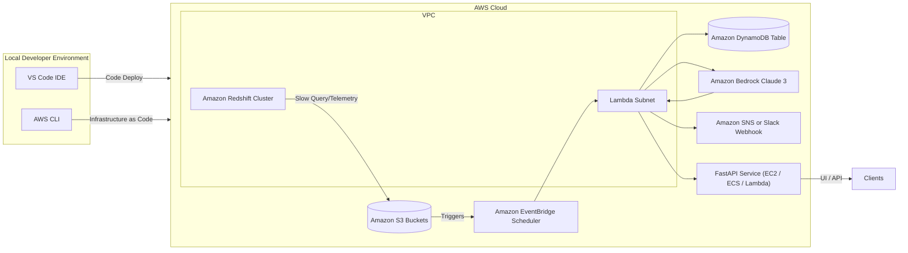

# AWS Redshift & Bedrock Migration Playbook

## 1. Introduction
This playbook provides a comprehensive, step-by-step guide for migrating the existing **MariaDB Query Optimizer FastAPI application** to an AWS-native ecosystem that analyzes **Amazon Redshift** workloads and uses **Claude models on Amazon Bedrock** for intelligent recommendations. The document assumes no prior AWS experience and covers every task required for the next working day, from account setup to operational readiness.

## 2. Prerequisites
1. **AWS Account & Permissions**
   - Root or administrative access (temporary) to enable Bedrock and create IAM roles.
   - MFA enabled on the account for security.
2. **Local Workstation Setup**
   - Python 3.11+ installed.
   - AWS CLI (`aws --version`) configured.
   - Git installed for version control.
3. **Existing Codebase**
   - Current FastAPI project (`B_Project`).
   - Access to new artifacts created by this migration plan.
4. **Planning Artifacts**
   - Client requirements PDF (attached).
   - This playbook.

## 3. High-Level Timeline
| Day | Track | Key Outcomes |
| --- | ----- | ------------ |
| Day 0 | Preparation | AWS account ready, permissions confirmed, local tooling installed |
| Day 1 | Infrastructure | VPC, Redshift cluster, S3 buckets, IAM roles provisioned |
| Day 1 | Bedrock Enablement | Claude Sonnet/Opus model access approved |
| Day 1 | Lambda Services | Query collector and orchestrator functions deployed |
| Day 1 | FastAPI Integration | New webhook endpoint and environment variables configured |
| Day 1 | Testing & Validation | End-to-end dry run with sample Redshift query |

## 4. Environment Diagram


## 5. Detailed Implementation Plan
### 5.1 Day 0 – Preparation
1. **Confirm AWS Access**
   - Log in to the AWS console using MFA.
   - Create an IAM user for yourself with AdministratorAccess (temporary) if needed.
2. **Install AWS CLI**
   - Download from https://aws.amazon.com/cli/ and install.
   - Run `aws configure` to supply Access Key, Secret Key, region (e.g., `us-east-1`), and default output `json`.
3. **Review Existing FastAPI Project**
   - Note the new integration points: ingest endpoint, history store extension.
   - Set up a new Git branch (e.g., `feature/aws-redshift-bedrock`).

### 5.2 Day 1 Morning – AWS Infrastructure Setup
1. **Create VPC and Networking (optional if existing)**
   - Use AWS Console VPC wizard or CloudFormation template to create:
     - VPC (CIDR: 10.0.0.0/16)
     - Private subnets for Redshift and Lambda
     - Public subnet (if using NAT/Internet) for testing
     - NAT Gateway for outbound internet if Lambdas need to reach Bedrock without VPC endpoints
2. **Provision Amazon Redshift Cluster**
   - Navigate to Redshift service → Create cluster.
   - Choose RA3 or DC2 nodes based on budget.
   - Set database name (e.g., `analytics`), admin user, and password (store in Secrets Manager).
   - Configure security group to allow Lambda subnet access (SG rules for port 5439).
3. **Configure Redshift Workload Management**
   - Set up separate queues for analytical loads vs. standard queries.
   - Enable automatic `wlm_json_status` logging.
4. **Create S3 Buckets**
   - `my-redshift-logs-bucket` for telemetry exports
   - `my-bedrock-outputs-bucket` for Claude responses (optional)
   - Enable default encryption (SSE-S3) and access logs.
5. **IAM Roles**
   - **Lambda Execution Role**: Permissions for Redshift Data API, Bedrock, DynamoDB, S3, CloudWatch Logs.
   - **Redshift IAM Role**: Permissions for S3 read/write if exporting logs.

### 5.3 Day 1 Morning – Bedrock Enablement
1. Navigate to **Amazon Bedrock → Model Access**.
2. Request activation for **Claude 3 Sonnet** and optionally **Claude 3 Opus** in `us-east-1`.
3. Wait for approval (usually minutes to hours).
4. Note the model IDs for use in Lambda: `anthropic.claude-3-sonnet-20240229-v1:0`.

### 5.4 Day 1 Afternoon – Lambda Functions & Event Bridge
1. **Query Collector Lambda** (Optional if using exports)
   - Runtime: Python 3.11.
   - Responsibilities: call Redshift Data API, run SQL to fetch slow queries, write results to S3 or directly to orchestrator queue.
   - Sample SQL to retrieve slow queries:
     ```sql
     SELECT query, database, userid, start_time, total_exec_time, rows, label
     FROM stl_query
     WHERE start_time >= dateadd(day, -1, getdate())
     ORDER BY total_exec_time DESC
     LIMIT 50;
     ```
   - Package dependencies (`boto3`, `psycopg2` if direct connection) via Lambda layer.
2. **Orchestrator Lambda**
   - Reads from S3 event or Query Collector output.
   - For each query, dispatches to sub-agent prompts using Bedrock.
   - Stores aggregated JSON in DynamoDB and optionally posts to FastAPI endpoint.
   - Include exponential backoff for Bedrock retries.
   - Core logic (pseudo-code):
     ```python
     def handler(event, context):
         queries = load_queries(event)
         for query_record in queries:
             recommendations = []
             for agent_type in ["optimize", "schema_review", "cost_review", "validate"]:
                 response_text = invoke_claude(AGENT_SYSTEM_PROMPTS[agent_type], build_user_prompt(query_record))
                 recommendations.append(json.loads(response_text))
             payload = assemble_payload(query_record, recommendations)
             save_to_dynamodb(payload)
             post_to_fastapi(payload)
     ```
3. **EventBridge Rules**
   - Schedule orchestrator every hour or trigger on `s3:ObjectCreated` events.
4. **DynamoDB Table** (e.g., `query-optimization-history`)
   - Partition key: `query_hash` (string)
   - Sort key: `analysis_timestamp`
   - Attributes: `workload_metadata`, `recommendations`, `agent_responses`.

### 5.5 Day 1 Afternoon – FastAPI Integration
1. **Environment Variables**
   - Add to `.env`: `AWS_REGION`, `BEDROCK_MODEL_ID`, `REDISHT_WEBHOOK_TOKEN` (shared secret).
2. **New Route**
   - Create `@app.post("/ingest/bedrock")` endpoint expecting JSON payload from orchestrator.
   - Validate bearer token header.
   - Insert payload into `HistoryStore` (existing JSONL or DynamoDB integration).
3. **Frontend Update**
   - Expose new metrics (e.g., `redshift_recommendations_count`) on `/metrics` route.
4. **Testing**
   - Use Postman or `curl` to POST sample payload to `/ingest/bedrock`.
   - Confirm `/history` and UI reflect new entries.

## 6. Detailed Configuration Steps
### 6.1 Secrets Management
1. Store Redshift credentials in **AWS Secrets Manager** (`/redshift/cluster-admin`).
2. Reference secrets in Lambda using environment variable `REDISHT_SECRET_ARN`.
3. Ensure Lambda role has `secretsmanager:GetSecretValue` permission.

### 6.2 VPC Endpoints (Optional, recommended for private setup)
1. Create VPC endpoints for:
   - Redshift Data API (`com.amazonaws.us-east-1.redshift-data`)
   - Bedrock runtime (`com.amazonaws.us-east-1.bedrock-runtime`)
   - S3 gateway endpoint
2. Update route tables for private subnets.

### 6.3 CloudWatch Monitoring
1. Create **Metrics** namespace `RedshiftOptimizer`.
2. Publish custom metrics from Lambda (e.g., `QueriesAnalyzed`, `BedrockLatencyMs`).
3. Set alarms for high error count or Bedrock throttling.

### 6.4 Notifications
1. Create SNS topic `redshift-optimization-alerts`.
2. Subscribe email and Slack webhook via HTTPS.
3. Modify orchestrator to publish notifications when recommendations include high-priority warnings (e.g., missing WHERE clause causing scans).

## 7. Operating Procedures
1. **Daily Checks**
   - Review CloudWatch dashboards for Lambda health.
   - Check DynamoDB entry counts and ensure new entries match Redshift query volume.
2. **Weekly Maintenance**
   - Rotate Redshift credentials via Secrets Manager rotation policy.
   - Review Bedrock usage in AWS Cost Explorer.
3. **Incident Response**
   - Error triggered via SNS when orchestrator fails.
   - Use CloudWatch logs to inspect stack traces and responses.
4. **Scaling**
   - Increase Lambda memory for faster Bedrock inference.
   - Use provisioned concurrency if high, predictable demand.

## 8. Security Considerations
- Enforce IAM least privilege throughout.
- Enable Redshift database auditing.
- Encrypt S3 buckets, DynamoDB tables, and logs with AWS-managed or customer-managed KMS keys.
- Scrub queries before sending to Bedrock to remove PII.
- Use HTTPS and signed payloads between Lambda and FastAPI.

## 9. Cost Estimate (Ballpark)
| Component | Estimated Cost |
| --------- | -------------- |
| Redshift (single RA3 node) | ~$1.20/hour |
| Lambda (100K requests, 512MB, 1s) | <$5/month |
| Bedrock Claude 3 Sonnet usage | Pay-per-token (~$0.003/1K tokens) |
| DynamoDB (on-demand) | <$5/month |
| S3 storage + requests | negligible for small logs |

## 10. Testing Checklist
1. **Infrastructure Validation**
   - Redshift cluster reachable from Lambda (test with simple `SELECT 1`).
   - S3 bucket accessible (upload test file).
2. **Lambda Dry Run**
   - Manually trigger orchestrator with sample event.
   - Confirm Bedrock response stored in DynamoDB.
3. **End-to-End**
   - Execute a slow query on Redshift.
   - Confirm log captured, orchestrator executed, FastAPI history updated, and email/Slack alert received.
4. **Failure Modes**
   - Simulate Bedrock timeout and verify retry/backoff.
   - Turn off Redshift cluster to ensure graceful error handling.

## 11. Deliverables by End of Next Working Day
1. **Infrastructure as Code Templates** (SAM/Terraform) committed to repo.
2. **Lambda Source Code** and deployment scripts.
3. **FastAPI Modifications** merged into branch with tests.
4. **Operational Runbook** (this playbook + CloudWatch dashboard snapshots).
5. **Demo Recording/Notes** showing end-to-end flow with sample data.

## 12. Future Enhancements
- Add support for **Explain Plan analysis** via Redshift `EXPLAIN` command.
- Use **Step Functions** to orchestrate multi-step agent workflows with branching logic.
- Integrate **Athena or QuickSight** dashboards for visualizing recommendations over time.
- Deploy FastAPI backend to AWS (ECS Fargate or Lambda via API Gateway) for full cloud-native setup.
- Expand to additional Bedrock models (Titan Text, JurassiQ) for complementary inference tasks.

## 13. Reference Materials
- [Amazon Redshift Documentation](https://docs.aws.amazon.com/redshift/latest/dg/welcome.html)
- [Amazon Bedrock Getting Started](https://docs.aws.amazon.com/bedrock/latest/userguide/what-is-bedrock.html)
- [AWS Lambda Developer Guide](https://docs.aws.amazon.com/lambda/latest/dg/welcome.html)
- [FastAPI Deployment on AWS](https://fastapi.tiangolo.com/deployment/)

---
**Next Action**: Begin executing Day 0 tasks immediately, verify resource creation in AWS console, and use this playbook as the master checklist for migration. Document progress in project tracker and schedule stakeholder walkthrough once the end-to-end test succeeds.
